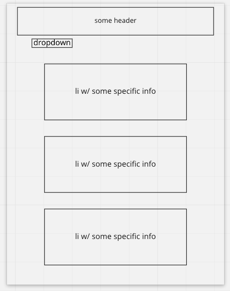

## The Golden Rule

🦸 🦸‍♂️ `Stop starting and start finishing.` 🏁

If you work on more than one feature at a time, you are guaranteed to multiply your bugs and your anxiety.

## Making a plan

1. **Make a drawing of your app. Simple "wireframes"**
    
1. **Once you have a drawing, name the HTML elements you'll need to realize your vision**
    - header, main, select with a couple of options, section, ul
1. **For each HTML element ask: Why do I need this?**
1. **Once we know _why_ we need each element, think about how to implement the "Why" as a "How"**
1. **Find all the 'events' (user clicks, form submit, on load etc) in your app. Ask one by one, "What happens when" for each of these events. Does any state change?**
    - when user selects an option from the dropdown, the page should render a specific api
1. **Think about how to validate each of your features according to a Definition of Done**
1. **Consider what features _depend_ on what other features. Use this dependency logic to figure out what order to complete tasks.**

Additional considerations:

- Ask: which of your HTML elements need to be hard coded, and which need to be dynamically generated?
- Consider your data model.
  - What kinds of objects (i.e., Dogs, Friends, Todos, etc) will you need?
  - What are the key/value pairs?
  - What arrays might you need?
  - What needs to live in a persistence layer?
- Is there some state we need to initialize?
- Ask: should any of this work be abstracted into functions? (i.e., is the work complicated? can it be reused?)

## Plan

- validate & ACP at each step
  - deploy on netlfiy & attach link to the about section on GitHub
  - create html elements
  - write function to fetch api(s)
  - grab DOM elements
  - write function to render api(s)
  - add eventListener to selector & specify which api to render when an option is selected
  - any styling or code reformatting

## Example Rubric

| App should include . . .                                                            |     |
| :---------------------------------------------------------------------------------- | --: |
| A list of information supplied from an API                                          |   0 |
| An if/else statement is used                                                        |   0 |
| README file with plan                                                               |   0 |
| Repo has a commit history with multiple commits and commit messages that make sense |   0 |
| Link in About section of repo to deployed site in Netlify                           |   0 |
| Work is done on a dev branch and a PR link is submitted to Canvas                   |   0 |
